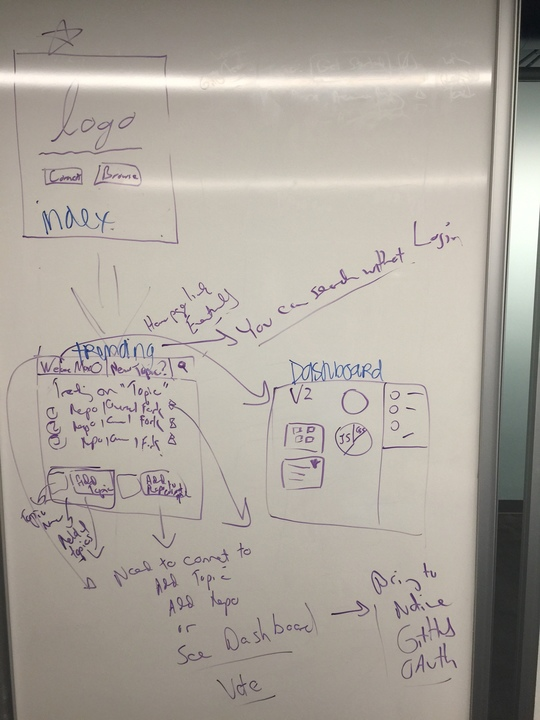

# Git Trending Design Doc

This is the starting design doc for the GitConnected, or GitTrending team
(we may need to go with GitTrending, simply because GitConnected is taken).

## Problem

There's a ton of great code in GitHub, but it can be very difficult to find code that might be useful to you.

GitHub has trending lists and you can search for people and repositories, but there since a conserted effort to make it easy to locate related repos, and especially understand which repos are the most useful.

And even though GitHub has stars to rate repos, you have to physically go to a repo to star it.
Those stars don't happen anywhere near as often as the actual repos are used.

We know this is a problem, because one common theme in GitHub is to create list repos like this one:
[https://github.com/asciimoo/ListOfGithubLists](https://github.com/asciimoo/ListOfGithubLists)
and this one:
[https://github.com/sindresorhus/awesome](https://github.com/sindresorhus/awesome)

## High-level view of our solution

We are building an app that lets developers create topics, add GitHub repos to these topics,
and up and down vote repos in the topics.

Developers can browse, simply to find the best repos related to a topic.
Developers can add their repos to topics, promoting their work.
And eventually, developers will be able to see how awesome their topics and repos
and other things of interest are doing in their dashboard.

It's kind of like bringing together Stack Overflow and GitHub,
and maybe a little Hacker News, if we enable comments eventually.

## MVC (minimum viable product)

Here's a picture of what we are aiming to build as our MVP:

And each of the following sections breaks down the work that needs to go into our app.

### Model

Owner: Shengtao

Using Sequelize

* User.js
* Topic.js
* Repo.js
* JoinTopicRepo.js
* JoinUserTopic.js
* JoinUserRepo.js

### Views

Owner: Max

Using Handlebars at the start, but if we have time, we will switch to React.

* main.handlebars
* index.handlebars
* trending.handlebars
* dashboard.handlebars

### Controller

Owner: Noel

Our business logic needs to cover...

* User login (GitHub integration)
* Search for topics in database
* Get list of repos for topic
* Post topic
* Post repo to topic

### Routes

Owner: Noel

* api-route.js
* html-route.js

### API

Owner: Shengtao

Working with GitHub API.

Users log in with GitHub account and we store their details in our database.

We will also work a good bit with GitHub API, as we build out the dashboard.

A little bit of user data will be pulled out of GitHub at least for MTV.

### Feeder Data

Owner: Meggin

* Michael's library list
* NPM modules topic
* Awesome lists topic
* Get Started with React topic

### Testing

Owner: Meggin

To be decided (we are learning testing suite on Saturday).

For sure, Meggin plans on testing on live version of our app,
as it grows over time.
That way we aren't trying to deploy at the last minute,
but gradually deploying the app in pieces over time.

### About us

We are a band of 4 given less than two weeks to come up with a good idea,
and implement a minimum viable product.

All of us will work on everything-- helping each other and learning from each other.

But we figured it's good to have a role too, so that we've got balance.

Here's a little bit about each of us:

* Max is our UX awesomeness. He is also the voice of reason, challenging us to ground our ideas in implementation specifics. He is very good at seeing the problem spots, and figuring out how to work around them.

* Shengtao is our back-end developer. He's gonna build our databases, and implement user management.

* Noel is taking on the business logic. She will work closely with Shengtao to make sure
we can do what we want to do with our data.

* Meggin is me. I'm typing this. I'm kind of the hodge podge of the group. I'm gonna help maintain our repo, help test all our PRs, and set up a good testing environment. I'm gonna dive in and help with code across the project. And I'm gonna write up our narrative, so we've got a great foundation for our awesome presentation.

## Future work

We want to create a user dashboard that lets you see how the topics you created are doing,
lets you check out your repos, and see how they are doing in topic lists,
and also, lets you connect with other developers working on similar topics.
